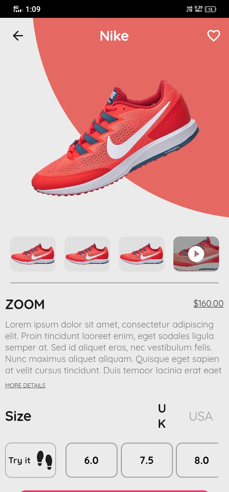

# 👟 Sneakers App

Sneakers App is a Flutter application designed to showcase a beautiful user interface for exploring and discovering the latest and trendiest sneakers. The app is crafted with a keen focus on delightful user experiences and engaging animations.

## ✨ Features

### 1. 🌟 Stunning UI
   - Clean and intuitive design.
   - Visually appealing layout for showcasing sneakers.

### 2. 📖 Sneaker Catalog
   - Browse through a curated catalog of the latest sneakers.
   - View details such as name, brand, price, and more.

### 3. 🎨 Animation Galore
   - Engaging animations for seamless transitions between screens.
   - Animated loading indicators and interactions for a lively experience.

### 4. 📱 Responsive Design
   - Support for various screen sizes and orientations.
   - Adaptive layout for an optimal experience on different devices.

## 📷 Screenshots
| Splash Screen | Home Screen | Detail Screen | Bag Screen | Profile Screen |
|---|---|---|---|---|
||||||

## 🚀 Getting Started

### Prerequisites
- Make sure you have Flutter installed. If not, follow the [official installation guide](https://flutter.dev/docs/get-started/install).

### Installation
1. **Clone the repository:**
   ```bash
   git clone https://github.com/umarazizdev/Sneakers-App.git
2. **Navigate to the project folder:**

    ```bash
    cd Sneakers-App
    ```

3. **Install dependencies:**

    ```bash
    flutter pub get
    ```

4. **Run the app:**

  ```bash
    flutter run

## 🙏 Acknowledgments

Thanks to the Flutter community for providing valuable resources and inspiration.
Icon made by Author from www.flaticon.com.
## 📬 Contact

If you have any questions or suggestions, feel free to contact us at [umer.aziz.dev@gmail.com].


# Sneakers App

Sneakers App is a Flutter application designed to showcase a beautiful user interface for exploring and discovering the latest and trendiest sneakers. The app is crafted with a keen focus on delightful user experiences and engaging animations.

## Features

### 1. Stunning UI
   - Clean and intuitive design.
   - Visually appealing layout for showcasing sneakers.

### 2. Sneaker Catalog
   - Browse through a curated catalog of the latest sneakers.
   - View details such as name, brand, price, and more.

### 3. Animation Galore
   - Engaging animations for seamless transitions between screens.
   - Animated loading indicators and interactions for a lively experience.

### 4. Responsive Design
   - Support for various screen sizes and orientations.
   - Adaptive layout for an optimal experience on different devices.

## Screenshots


*Caption for Home Screen*


*Caption for Detail Sccreen*


*Caption for Bag Sccreen*


*Caption for Profile Sccreen*


## Getting Started

### Prerequisites
- Make sure you have Flutter installed. If not, follow the [official installation guide](https://flutter.dev/docs/get-started/install).

### Installation
1. Clone the repository:
   ```bash
   git clone https://github.com/umarazizdev/Sneakers-App.git

2. **Navigate to the project folder:**

    ```bash
    cd Sneakers-App
    ```

3. **Install dependencies:**

    ```bash
    flutter pub get
    ```

4. **Run the app:**

  ```bash
    flutter run
    ```
## Acknowledgments

Thanks to the Flutter community for providing valuable resources and inspiration.
Icon made by Author from www.flaticon.com.


## Contact
If you have any questions or suggestions, feel free to contact us at [umer.aziz.dev@gmail.com].
